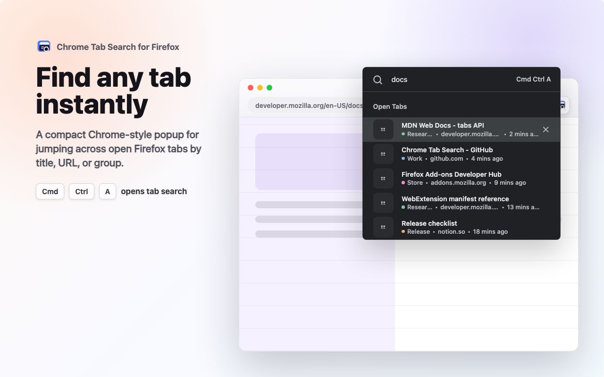
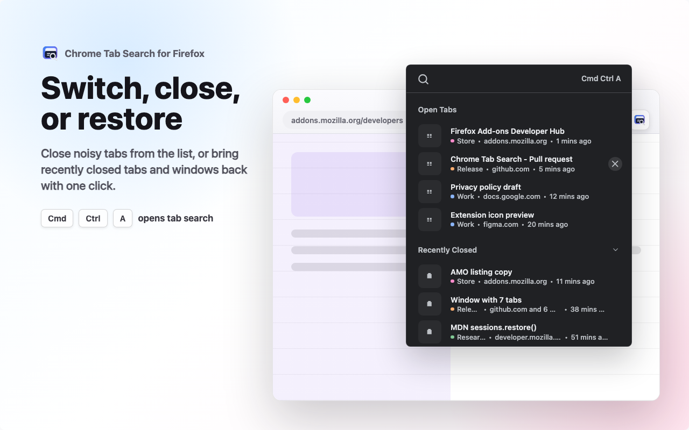
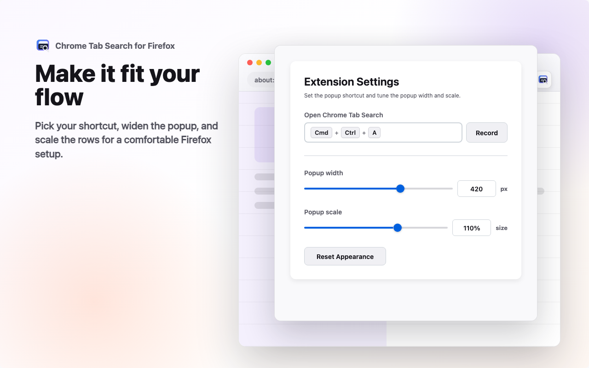

# Chrome Tab Search

[](https://addons.mozilla.org/en-US/firefox/addon/chrome-tab-search/)
[](https://addons.mozilla.org/en-US/firefox/addon/chrome-tab-search/)
[](https://addons.mozilla.org/en-US/firefox/addon/chrome-tab-search/)
[](https://github.com/wilmtang/chrome-tab-search/actions/workflows/firefox-extension.yml)
[](LICENSE)

A Firefox extension that recreates Chrome's Tab Search popup for Firefox: search open tabs, jump to a result, spot tabs playing audio, close tabs from the list, restore recently closed tabs or windows, and see tab group indicators.

## Why

Chrome Tab Search is for users who like Firefox but want the exact same feel and workflow of Chrome's built-in Tab Search. If your muscle memory expects one compact popup where you can type part of a tab title, jump straight to it, find the tab that is playing audio, close noisy tabs, or bring back something you just closed, this extension is meant to make Firefox feel familiar again.

The goal is intentionally narrow: make tab search behave like the Chrome feature people already know, while using the Firefox WebExtension APIs available today.

## Screenshots

These store screenshots are generated from [`store-screenshots/scene.html`](store-screenshots/scene.html).

| Search open tabs | Close and restore tabs |
| --- | --- |
|  |  |

| Customize shortcut and size | Find tabs playing audio |
| --- | --- |
|  |  |

## Highlights

- Chrome-style popup with dark-mode support.
- Chrome-matched MRU ordering, with the current focused-window tab moved to the bottom so Enter quickly switches to another tab.
- Chrome-style ranked search across tab title, hostname, and visible tab group name, with bold hit highlighting.
- Audio & Video section for audible or muted tabs when not searching, including speaker and muted indicators.
- Recently Closed parity with flattened closed windows, duplicate filtering, and the same compact display limit Chrome uses.
- Switch to tabs across normal Firefox windows.
- Close open tabs from the right-side close button.
- Restore recently closed tabs through Firefox session restore.
- Show tab group indicators using Firefox's `tabGroups` API when available.
- Customizable shortcut from the options page. Default is `Cmd + Ctrl + A` on macOS and `Ctrl + Alt + A` on Windows/Linux.

## Shortcut

The shortcut opens the same popup as the toolbar button. Change it from the extension options page or Firefox's built-in extension shortcut manager.

Firefox does not let extensions override reserved browser shortcuts. In particular, `Cmd + Shift + A` is already owned by Firefox on macOS, so this extension cannot claim it. The default shortcut is `Cmd + Ctrl + A` on macOS and `Ctrl + Alt + A` on Windows/Linux.

## Local Testing

1. Open Firefox and go to `about:debugging`.
2. Select **This Firefox**.
3. Choose **Load Temporary Add-on...**.
4. Select this repository's `manifest.json`.
5. Click the toolbar button or press the configured shortcut.

Temporary add-ons are removed when Firefox restarts.

## Limitations

- Firefox controls extension popup sizing, so the popup cannot be made as large or as flexible as Chrome's built-in Tab Search UI.
- Firefox does not let extensions override existing reserved browser shortcuts such as `Cmd + Shift + A`.

These are browser limitations rather than extension bugs, so they cannot be fixed from this plugin.

## Publishing

Firefox publication is handled by `.github/workflows/firefox-extension.yml`. The workflow validates every relevant pull request and push. When a push to `main` changes `manifest.json`'s version, the workflow automatically creates a matching `firefox-extension-v*` tag. Firefox Add-ons upload runs when either:

- a `firefox-extension-v*` tag is pushed, for example `firefox-extension-v1.0.0`, and the tag version matches `manifest.json`;
- the workflow is run manually with `publish=true`.

Add `AMO_JWT_ISSUER` and `AMO_JWT_SECRET` to the `firefox-addons` GitHub Actions environment. The workflow passes them to `web-ext` as `WEB_EXT_API_KEY` and `WEB_EXT_API_SECRET`.

Listed AMO uploads use `--approval-timeout=0`, so CI submits the version and exits without waiting for Mozilla approval or downloading the signed `.xpi`. After approval, the signed file is available from the version page in Firefox Add-ons Developer Hub.

Local release checks:

```bash
npm run lint
npm run build
```

## Notes

Chrome's desktop help documents Tab Search as a tab-strip button and shortcut that lets users find open tabs, open a selected result, and close tabs from the result list. Firefox exposes the matching extension capabilities through the `tabs`, `sessions`, `commands`, and `tabGroups` WebExtension APIs.
